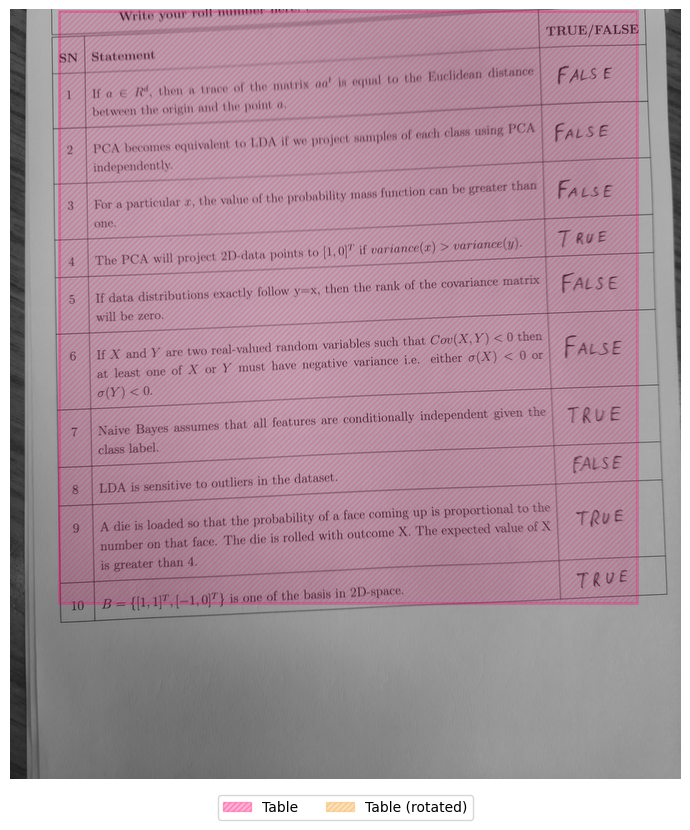
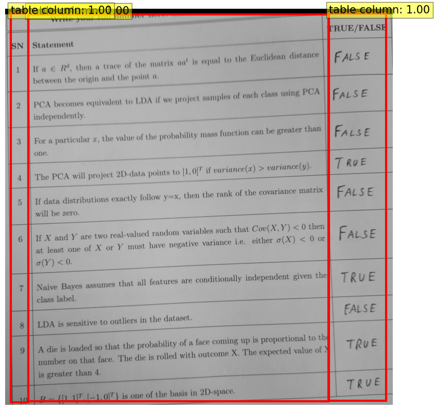
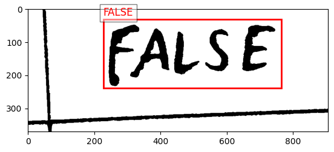

# NCVPRIPG-AutoEval

## This readme file is still in development 
Challenge website - https://vl2g.github.io/challenges/AutoEval2024/#schedule2

This project involves detecting tables and text from images using pre-trained models and Optical Character Recognition (OCR). The goal is to prepare the images for accurate extraction of tabular data using OCR methods and then comparing the answers written by the student to the answer key and calculating the score.

## To evaluate, please see below two colab files: 
1. sub-optimized.ipynb - It is properly documented and will take input of one image to show to flow of the code.
2. optimized-final.ipynb - It takes input of a folder containing all test_images and directly returns csv file containing the image names and their score.

## Table of Contents

1. [Installation](#installation)
2. [Usage](#usage)
3. [Code Overview](#code-overview)
4. [Explanation of Key Functions](#explanation-of-key-functions)
5. [Post-processing](#post-processing)
6. [Results](#results)
7. [Score](#score)
8. [Application](#application)
9. [Demonstration of Preprocessing Steps](#demonstration-of-preprocessing-steps)
10. [References](#references)
11. [Contributors](#contributors)

## Installation

To run the code, you need to install the required libraries and tools:

```bash
pip install pytesseract
pip install opencv-python-headless
pip install matplotlib
pip install numpy
pip install transformers
pip install torch
pip install torchvision
pip install pillow
pip install tqdm
pip install pandas
```

## Usage

1. **Install Required Packages**

2. **Run the Script**:
   - Execute the Python script `pre_processing_sub_optimized.py` using the Python interpreter. Make sure to provide the correct path to the input image.

3. **View Results**:
   - Check the terminal for OCR results and the calculated score.

## Code Overview

The code consists of the following sections:

1. **Import Libraries**: Importing necessary libraries.
2. **Detecting and Correcting Image Rotation + Preprocessing for Table Detection**: Open and preprocess the original image, detect and correct the rotation angle, and prepare the image for table detection.
3. **Table Region and Structure Detection Using a Pre-trained Model**: Use a pre-trained model to detect tables and their structures.
4. **Cropping Detected Table Regions**: Crop the detected table regions for further processing.
5. **Perform OCR on the Cropped Images**: Use the TrOCR model to perform OCR on the cropped images.
6. **Post-processing of OCR Results**: Clean up and normalize the OCR results.

## Explanation of Key Functions

### Image Rotation Detection and Correction

- **Open the original image**: Open the image using OpenCV.
- **Enhance the contrast of the image**: Convert the image to grayscale and binarize it.
- **Perform OCR to detect the rotation angle**: Use Tesseract OCR to detect the rotation angle.
- **Rotate the image based on the detected angle**: Rotate the image if needed.

### Table Detection

- **Define custom resize transformation**: Resize the image while maintaining its aspect ratio.
- **Postprocessing functions**: Convert bounding boxes to the appropriate format and rescale them.
- **Visualization function**: Visualize the detected tables on the image.

### Table Cropping

- **Crop table function**: Crop the detected tables from the image.
- **Visualize detected objects**: Visualize the detected table regions.

### OCR

- **Load processor and model**: Load the TrOCR processor and model.
- **Perform OCR on the preprocessed image**: Use TrOCR to extract text from the images.

### Post-processing

- **Normalize text**: Normalize the text by removing special characters and converting it to lowercase.
- **Post-process OCR results**: Clean up and normalize the OCR results to correctly identify true and false values.

## Score

- **Calculation and display of score**: The score is calculated based on the ModelAnswer.csv file which contains correct answers of the question paper.

## Application

This code is designed for storing the scores of students' handwritten answer sheets. The workflow involves scanning a table where the rightmost columns contain handwritten "true" or "false" answers, and other cells contain their corresponding questions and serial numbers.

## Demonstration of Preprocessing Steps

The preprocessing of the image involves several steps. Below is a step-by-step demonstration with images and arrows to illustrate the process:
## Process

| Step                      | Description                                                        | Image                                                             |
|---------------------------|--------------------------------------------------------------------|-------------------------------------------------------------------|
| 1. Original Image         | An image of the student's answer sheet.                            |                     |
| ↓                         |                                                                    |                                                                   |
| 2. Rotation Correction    | Detect and correct any rotation in the image.                      |                       |
| ↓                         |                                                                    |                                                                   |
| 3. Median Blur and Binarization | Apply median blur to remove noise and binarize the image to enhance contrast. |                       |
| ↓                         |                                                                    |                                                                   |
| 4. Total Table Detection | Highlight the entire table region in the image.  |                              |
| ↓                         |                                                                    |                                                                   |
| 5. Row and Column Detection  |  Detect rows and columns to identify the structure of the table.                  |                                |
| ↓                         |                                                                    |                                                                   |
| 6. Individual Cell Extraction | Extract individual cells containing handwritten "true" or "false" values. |                                    |


### Summary of Preprocessing Steps

1. **Original Image**: Start with the original scanned image of the student's answer sheet.
2. **Rotation Correction**: Detect and correct any rotation in the image.
3. **Median Blur and Binarization**: Apply median blur to remove noise and binarize the image to enhance contrast.
4. **Row and Column Detection**: Detect the rows and columns to identify the structure of the table.
5. **Total Table Detection**: Highlight the entire table region in the image.
6. **Individual Cell Extraction**: Extract individual cells containing handwritten answers.

*Note: Arrows and annotations in the images are meant to illustrate the preprocessing steps.*

## References

- [Hugging Face Transformers Documentation](https://huggingface.co/transformers/)
- [Microsoft Table Transformer Documentation](https://huggingface.co/microsoft/table-transformer-detection)
- [Microsoft TrOCR Documentation](https://huggingface.co/microsoft/trocr-large-handwritten)

## Contributors

- Kashvi Pandya
- Samriddhi Jain
- Atharva Date
