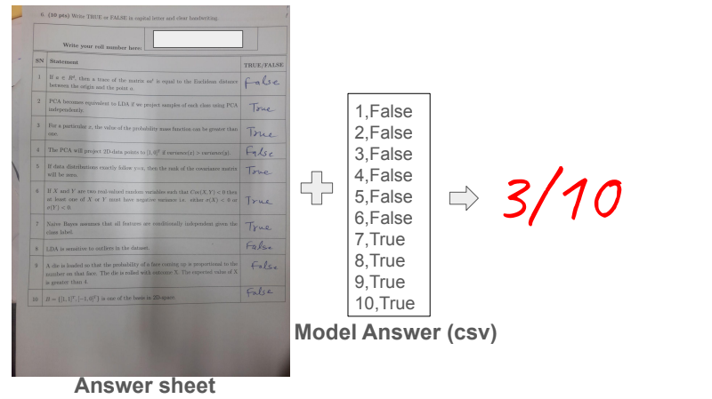

#  NCVPRIPG@AutoEval2024 Submission
*This project is proudly developed as part of the Summer Challenge on Automatic Evaluation of Handwritten Answer Sheets, hosted as part of the National Conference on Computer Vision, Pattern Recognition, Image Processing and Graphics (NCVPRIPG'24).*

-----
## Problem Statement:
Given a set of handwritten answersheets in a predetermined layout, the task is to automatically evaluate them and return the total marks scored by the student based on the correct answers. 
<div align="center">
    
</div>

The answersheets contain a set of questions with the rightmost columns containing handwritten "true" or "false" answers. The goal is to extract the answers from the images, compare them with the correct answers (in csv format), and calculate the score.

For more info on the dataset and evaluation criteria, please refer to the challenge website: [AutoEval2024](https://vl2g.github.io/challenges/AutoEval2024/)

## Table of Contents

1. [Project Overview](#project-overview)
2. [Demonstration](#demonstration)
3. [Setup](#setup)
4. [Usage](#usage)
5. [How it works](#how-it-works)
6. [References](#references)
7. [Acknowledgements](#acknowledgements)
8. [Contributors](#contributors)

## Project Overview
The <b>Automatic Evaluation of Handwritten Answer Sheets</b> project aims to revolutionize the grading process of handwritten exams by leveraging advanced image processing and machine learning techniques. Our approach involves a multi-step pipeline in evaluating handwritten responses.

- Firstly, we preprocess the images to enhance quality by correcting rotation, reducing noise, and improving contrast. 
- Next, we detect table structures within the answer sheets using microsoft's pre-trained table detection and table structure detection models, allowing us to accurately locate the regions of interest. 
- We then employ Optical Character Recognition (OCR) with <b> trOCR </b> *(pre-trained model on IAM dataset)* to extract handwritten text from these regions.
- Finally, we compare the extracted answers with the correct answers provided in a CSV file, and compute the total score for each answer sheet.

## Demonstration
Below is a step-by-step demonstration of the project workflow:

| Step                      | Description                                                        | Image                                                             |
|---------------------------|--------------------------------------------------------------------|-------------------------------------------------------------------|
| 1. Original Image         | An image of the student's answer sheet from test data.                             |                     | 
| 2. Pre-processed Image    | Rotation corrected, Noise reduced, Median Blurred Image.                       |                       |
| 3. Table Detection        | Detected table region in the pre-processed image.                           |                       |
| 4. Table Cropped         | Extracted the detected table region for further processing.                           |                       |
| 5. Table Structure Recognition           | Rows and Columns in the table being detected and plotted along with their confidence.                      |                       |                   |
| 6. Cropped and Binarized handwritten text cells         | Cropped out specific cells from the last column to apply OCR on the focused region. The attached example image corresponds to the first answer in the answer sheet.                           |                       |
| 7. OCR Results         | OCR results on the cropped cell (trOCR).        |                       |


## Setup

1. **Clone this repository**:
   
   ```bash
   git clone https://github.com/samj786/NCVPRIPG-AutoEval.git
   cd AutoEval
   ```

2. **Install the required packages**:

   ```bash
   pip install pytesseract
   pip install opencv-python-headless
   pip install matplotlib
   pip install numpy
   pip install transformers
   pip install torch
   pip install torchvision
   pip install pillow
   pip install tqdm
   pip install pandas
   ```
3. **Download tesseract-OCR:** 
   
   Ensure you have Tesseract OCR installed on your system.
   - For Windows:
      1. Download the installer from [UB Mannheim](https://github.com/UB-Mannheim/tesseract/wiki)
      2. Run the installer and note the installation directory
      3. Add the Tesseract installation directory to your system PATH

   - For macOS (using Homebrew):
      ```bash
      brew install tesseract
      ```
4. **Pre-trained models**:
   
   The pre-trained models will be downloaded automatically when you run the script for the first time. These include:
   - Microsoft Table Transformer for detection
   - Microsoft Table Structure Recognition model
   - Microsoft TrOCR model for handwritten text recognition

   **Note**: Ensure you have a stable internet connection for the initial run, as the models will be downloaded from the *Hugging Face model* hub.

## Usage

1. Place your test images in the `test_images` folder. The images should be in jpeg format and follow the same layout as the provided sample images.

2. Ensure you have the following CSV files in the project directory:
   - `img_model_answer_mapping.csv`: Maps image names to model answer types
   - `model_answer_type1.csv`: Contains model answers for type 1
   - `model_answer_type2.csv`: Contains model answers for type 2

   **Note:** If you have a different number of model answer types, you can modify the code accordingly.

3. **Run the Script**:
   - Execute the Python script `test.py` using the Python interpreter. 
      ```bash
      python test.py
      ```

3. **View Results**:    
   - Check the terminal for the calculated score for each answer sheet, as it is being processed.
   - Finally, the script will generate a `finaloutput.csv` file with the results; this file will contain the image names and their corresponding scores.

## How it works

1. The script reads each image and corrects its rotation if necessary. For rotation correction we use tesseract OCR's `osd` to detect the orientation of the text in the image. 
2. It then detects the table region in the image using `microsoft/table-transformer-detection` model.
3. The table structure is recognized, identifying rows and columns, using `microsoft/table-structure-recognition-v1.1-all` model.
4. The last column of the table is extracted, using co-ordinates from the table structure detection.
5. Each cell in the last column is processed one by one using OCR i.e. `microsoft/trocr-large-handwritten` model.
6. The OCR results are post-processed and cleaned.
7. The cleaned results are compared with the correct answers from the model answer files.
8. Scores are calculated and saved to `finaloutput.csv`.

## Note
This script is designed for a specific use case and may require modifications for different table formats or image types. Adjustments to thresholds and post-processing logic might be necessary for optimal performance on varied datasets.


## References

- [Hugging Face Transformers Documentation](https://huggingface.co/transformers/)
- [Microsoft Table Transformer Documentation](https://huggingface.co/microsoft/table-transformer-detection)
- [Microsoft TrOCR Documentation](https://huggingface.co/microsoft/trocr-large-handwritten)
- [Microsoft Table Structure Recognition Documentation](https://huggingface.co/microsoft/table-structure-recognition-v1.1-all)


## Acknowledgements

- We would like to thank the organizers of the NCVPRIPG'24 AutoEval2024 challenge for providing us with the opportunity to work on this exciting project.

- Special thanks to the developers of the pre-trained models and the open-source community for their invaluable contributions. You guys are awesome!

-----
## Contributors

- Kashvi Pandya
- Samriddhi Jain
- Atharva Date